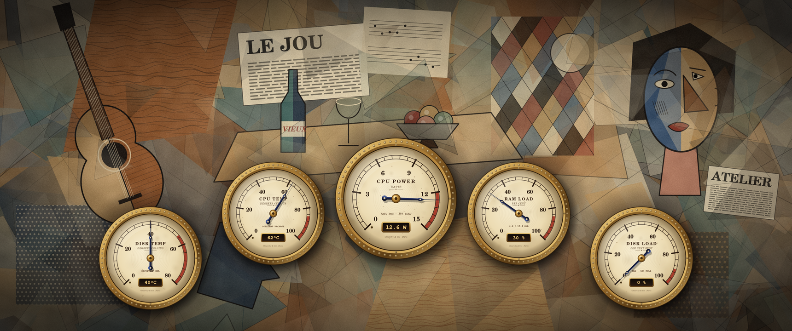

# Omarchy Live Wallpaper

A live wallpaper for [Omarchy](https://omarchy.org) (Arch Linux + Hyprland): five vintage brass
gauges that show what your computer is doing right now, sitting on top of an original
Cubist-style painting.



The gauges, from left to right:

| Gauge | What it shows | Where the number comes from |
|---|---|---|
| **DISK TEMP** | Temperature of your system disk | NVMe sensor, or `drivetemp` for SATA drives |
| **CPU TEMP** | CPU package temperature | `coretemp` (Intel), `k10temp` (AMD), or a thermal zone |
| **CPU POWER** | How many watts the CPU package is using | RAPL energy counter (Intel and AMD) |
| **RAM LOAD** | Memory in use | `/proc/meminfo` |
| **DISK LOAD** | How busy the system disk is | `/proc/diskstats` |

## Features

- **Looks like a wallpaper, behaves like one.** It is drawn on the Hyprland *bottom* layer, above
  your normal background and below all windows. Clicks go straight through it.
- **Light on resources.** Sensors are read once per second and only the gauges whose reading
  actually changed get redrawn. The dial faces are drawn once and cached. On an Intel N95 mini PC
  it uses about 0.4% CPU.
- **Finds your hardware by itself.** It picks the disk that holds `/` (NVMe or SATA, also through
  LUKS encryption and btrfs), and the right temperature and power sensors for Intel or AMD. No
  setup needed.
- **Doesn't break if a sensor is missing.** A gauge with no sensor just rests at zero and shows
  `--`. If the CPU power counter can't be read, that gauge shows CPU load % instead.
- **Multi-monitor.** Draws on all monitors by default, or only on the ones you pick.
- **Original artwork.** The background is generated by code (`make_background.py`) from simple
  shapes and a fixed random seed. No existing artwork is copied.
- **Easy to remove.** `./uninstall.sh` puts everything back the way it was.

## Requirements

- Arch Linux or Omarchy, running Hyprland (it should also work on other compositors that support
  wlr-layer-shell, but only Hyprland is tested)
- systemd (for the user service)
- These packages, which the installer offers to install for you:
  `python`, `python-gobject`, `python-cairo`, `gtk4`, `gtk4-layer-shell`, `gsfonts`
  (all from the official Arch repos; `gsfonts` provides the vintage typefaces)

## Install

```bash
git clone https://github.com/sir-analog-a-lot/omarchy-live-wallpaper && cd omarchy-live-wallpaper && ./install.sh
```

The installer:

1. checks that you're on Arch/Omarchy with Hyprland,
2. lists any missing packages and asks before installing them with `pacman`,
3. copies the program to `~/.local/share/omarchy-live-wallpaper/` and a small launcher to
   `~/.local/bin/omarchy-live-wallpaper`,
4. installs and starts the systemd user service `omarchy-live-wallpaper.service`,
5. then offers an **optional** step that needs `sudo`. Each part is asked separately and the
   default answer is No:
   - **drivetemp**: loads the `drivetemp` kernel module now and at boot. You only need this for
     SATA drives, since NVMe drives report their temperature without it.
   - **RAPL access**: lets your user group read the CPU energy counter, so the CPU POWER gauge can
     show watts. Please read the [security note](#a-note-on-cpu-power-and-security) first.

You can run `./install.sh` again at any time. It updates the files and changes nothing else.
Options: `--yes` (don't ask about packages), `--no-system` (skip the sudo step),
`--force` (skip the Arch/Hyprland checks).

## Configuration

Nothing needs configuring. If you want to change something, edit
`~/.config/omarchy-live-wallpaper/config.toml` (the installer creates one where every option is
commented out) and restart the service:

```toml
disk = "nvme0n1"          # which disk to watch ("auto" = the one holding /)
power_max = 35            # full scale of the CPU POWER gauge in watts (0 = auto)
interval = 1.0            # seconds between updates (minimum 0.25)
monitors = "all"          # "all", "primary", "DP-1", or ["DP-1", "HDMI-A-1"]
background = "default"    # "default", "none" (transparent over your usual wallpaper), or a path
cpu_gauge = "auto"        # "auto", "power" (always watts) or "load" (always %)
layer = "bottom"          # "bottom" or "background"
```

```bash
systemctl --user restart omarchy-live-wallpaper
```

See [`config.example.toml`](config.example.toml) for every option. Most options can also be given
on the command line (`omarchy-live-wallpaper --help`).

If `power_max` is 0, the scale of the CPU POWER gauge comes from the CPU's own power limit, rounded
up to the next step of 15, 25, 35, 45, 65, 95, 125, 170, 250 or more watts. For example, an Intel N95
gets 0–15 W. If the CPU doesn't report a limit (common on AMD), the scale is guessed from the
number of CPU cores.

Everyday commands:

```bash
systemctl --user stop omarchy-live-wallpaper            # hide it until next login
systemctl --user disable --now omarchy-live-wallpaper   # turn it off for good
systemctl --user enable --now omarchy-live-wallpaper    # turn it back on
omarchy-live-wallpaper --print-sensors                  # show detected sensors and readings
omarchy-live-wallpaper --render-png /tmp/frame.png      # save one frame as an image
```

To make your own background (needs `python-numpy` and `python-pillow`):

```bash
python3 make_background.py 3440 1440 ~/Pictures/cubist.png
```

## Troubleshooting

Start by running `omarchy-live-wallpaper --print-sensors`. It shows which disk and sensors were
found, whether the power counter can be read, and the current readings.

**DISK TEMP shows `--` and the small text says `MODPROBE DRIVETEMP`.** Your disk is SATA and the
`drivetemp` module isn't loaded. Re-run `./install.sh` and say yes to drivetemp, or run
`sudo modprobe drivetemp` to load it once. The gauge picks it up within about 30 seconds. Some USB
enclosures and very old drives don't report a temperature at all.

**DISK TEMP or CPU TEMP shows `--` and the small text says `NO SENSOR`.** No matching sensor was
found. Look in `ls /sys/class/hwmon/*/name` for a sensor, then set `drive_temp_sensor` or
`cpu_temp_sensor` in the config to its `temp*_input` file.

**The middle gauge says CPU LOAD instead of CPU POWER,** or it shows `N/A` with `NO RAPL ACCESS`.
Only root can read the RAPL energy counter until you allow it. Re-run `./install.sh` and say yes to
RAPL access, after reading the note below. If you'd rather not, set `cpu_gauge = "load"`. With
`NO RAPL SENSOR`, your CPU or VM has no RAPL counter at all.

**The wrong disk is shown.** Set `disk = "sda"` (or whichever you want; see `lsblk -d`).

**Nothing appears.** Check `systemctl --user status omarchy-live-wallpaper` and
`journalctl --user -u omarchy-live-wallpaper -b`. The service starts with the graphical session,
so it needs a normal Hyprland login (Omarchy uses uwsm, which handles this).

**The gauges are on the wrong monitor.** Set `monitors = ["DP-1"]` using the names from
`hyprctl monitors`.

## Uninstall

```bash
./uninstall.sh
```

This stops and removes the service, the program and the launcher. It asks before deleting your
config, and asks before using `sudo` to remove the optional system files (the udev rule, the
tmpfiles entry and the drivetemp autoload). Removing those also makes the RAPL counter root-only
again.

## A note on CPU power and security

The CPU POWER gauge reads the RAPL energy counter. In 2020 researchers showed an attack called
**PLATYPUS** (CVE-2020-8694 / CVE-2020-8695): by reading this counter very often, an unprivileged
program can learn something about what other code on the same CPU is doing. In the lab this was
enough to recover bits of cryptographic keys. Since then, Linux lets only root read the counter.

The optional install step gives read access back to one group: `wheel` if you're in it (as on
Omarchy), otherwise your own user group. Any program running as a member of that group could then
read it too. On a personal, single-user desktop the extra risk is small. Anything already running
as you can do far worse things, and the attack is slow and noisy. Still, it is a real trade-off,
so the step is optional and off by default. If you skip it, everything else works and the gauge
shows CPU load instead of watts.

The installer does this with two small files: a udev rule
(`/etc/udev/rules.d/99-omarchy-live-wallpaper-rapl.rules`) and a tmpfiles entry
(`/etc/tmpfiles.d/omarchy-live-wallpaper-rapl.conf`). `./uninstall.sh` can remove them.

## How it works

- `omarchy_live_wallpaper.py` is a single Python file. It uses GTK4 with gtk4-layer-shell to
  create one full-screen layer surface per monitor with an empty input region, so clicks pass
  through. The painting is a `Gtk.Picture`, and each gauge is a `Gtk.DrawingArea` drawn with Cairo.
- All sensor code reads `/proc` and `/sys` directly and doesn't need GTK. That's what
  `--print-sensors` uses, and it's covered by headless tests you can run with
  `python3 -m unittest discover -s tests -v`.
- `bin/omarchy-live-wallpaper` is the launcher. It preloads `libgtk4-layer-shell.so`, which
  gtk4-layer-shell needs when used from Python.

## License

MIT. See [LICENSE](LICENSE). The background image is generated by `make_background.py` and is
covered by the same license.
